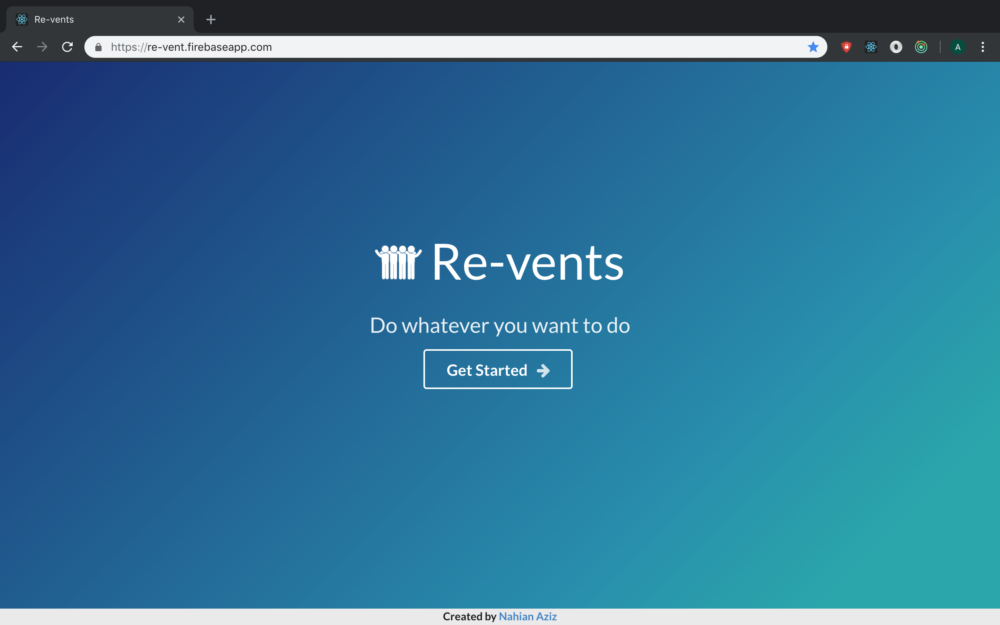
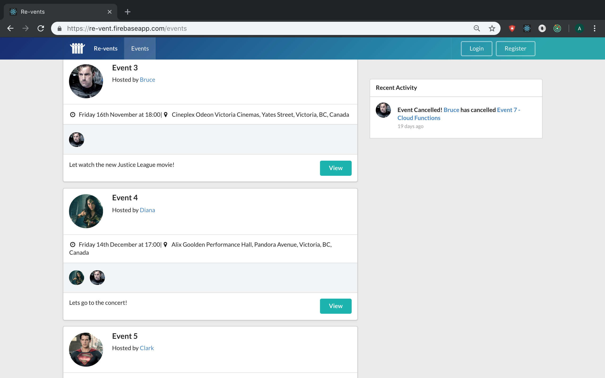
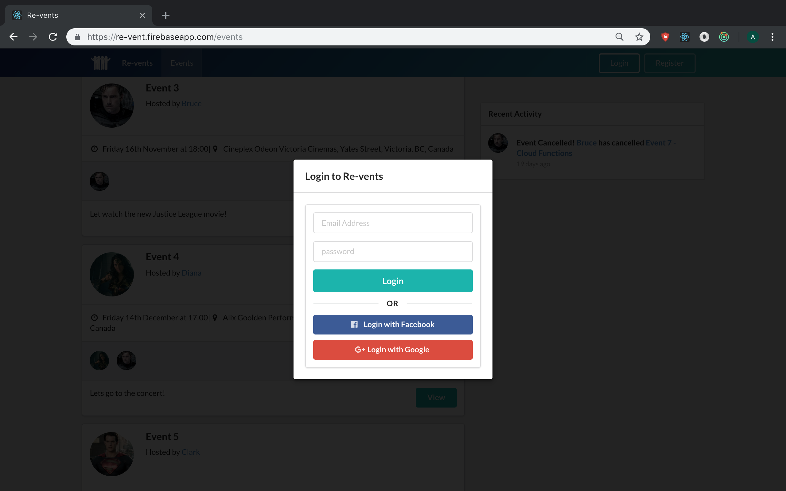

# Re-vents - Set up events and meet people who share your interests.

  

## Introduction

Re-vents is a React app kinda inspired by meetup and facebook events. 

## Demo

A demo of the app can be found [here](https://re-vent.firebaseapp.com/).

## Project Features

- React 16 and modern JavaScript (ES2015 and beyond)
- Redux
- Cloud Firestore
- React Router 4
- Semantic UI React
- Create and join events
- Inifite scroll pagination
- Social logins
- Google Maps
- Comment and reply to comments section
- Drag and drop profile photos
- Recent activity section, that shows you all the recents changes made

### Development

- Nahian Aziz
